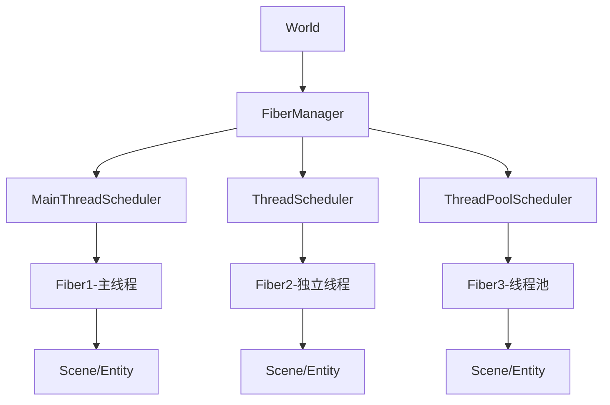

# ET框架Fiber纤程系统详解

## Fiber概念介绍

Fiber（纤程）是ET8.0的核心创新，类似于Erlang的进程概念。它是一个**轻量级的执行单元**，提供了**多核利用**能力，同时保持**单线程开发体验**。

## 设计理念



### 核心特性
- **轻量级**: 比操作系统线程轻量1000倍
- **隔离性**: 每个Fiber拥有独立的EntitySystem和内存空间
- **透明性**: 单线程编程模型，无需考虑锁和线程安全
- **可扩展**: 动态创建/销毁，灵活的资源分配

## 三种调度策略

### 1. MainThreadScheduler (主线程调度)
```csharp
// 适用场景：UI逻辑、Unity API调用、轻量计算
await FiberManager.Instance.Create(
    SchedulerType.Main,        // 主线程调度
    zone: 1,                   // 区域ID
    SceneType.Current,         // 场景类型
    "MainLogicFiber"          // 纤程名称
);
```

**特点**:
- 在Unity主线程中轮询执行多个Fiber
- 所有Fiber共享主线程时间片
- 适合处理Unity相关操作和UI逻辑

### 2. ThreadScheduler (独立线程调度)
```csharp
// 适用场景：网络IO、数据库操作、独立的游戏逻辑
await FiberManager.Instance.Create(
    SchedulerType.Thread,      // 独立线程调度
    zone: 1,
    SceneType.NetInner,        // 网络处理场景
    "NetworkFiber"
);
```

**特点**:
- 每个Fiber拥有独立的线程
- 真正的并行执行
- 适合IO密集型和长时间运行的任务

### 3. ThreadPoolScheduler (线程池调度)
```csharp
// 适用场景：计算密集型任务、批处理、短时间任务
await FiberManager.Instance.Create(
    SchedulerType.ThreadPool,  // 线程池调度
    zone: 1,
    SceneType.AI,             // AI计算场景
    "AICalculationFiber"
);
```

**特点**:
- 多个Fiber共享线程池
- 适合计算密集型任务
- 系统自动调度负载均衡

## Fiber生命周期管理

### 创建Fiber
```csharp
public class FiberCreationExample
{
    public async ETTask CreateGameFibers()
    {
        // 创建网络处理Fiber
        int networkFiberId = await FiberManager.Instance.Create(
            SchedulerType.Thread,
            zone: 1,
            SceneType.NetClient,
            "NetworkHandler"
        );

        // 创建AI计算Fiber
        int aiFiberId = await FiberManager.Instance.Create(
            SchedulerType.ThreadPool,
            zone: 1,
            SceneType.AI,
            "AIProcessor"
        );

        // 创建逻辑处理Fiber
        int logicFiberId = await FiberManager.Instance.Create(
            SchedulerType.Main,
            zone: 1,
            SceneType.Map,
            "GameLogic"
        );
    }
}
```

### 销毁Fiber
```csharp
// 安全销毁Fiber
await FiberManager.Instance.Remove(fiberId);
```

## Fiber内部结构

### 核心组件
```csharp
public class Fiber : IDisposable
{
    public int Id;                      // Fiber唯一标识
    public int Zone;                    // 所属区域
    public Scene Root;                  // 根场景
    public EntitySystem EntitySystem;   // Entity系统
    public Mailboxes Mailboxes;        // 消息邮箱
    public ThreadSynchronizationContext ThreadSynchronizationContext; // 线程同步上下文
    
    // ThreadStatic - 每个线程独立的Fiber实例
    [ThreadStatic]
    internal static Fiber Instance;
}
```

### 访问当前Fiber
```csharp
public class FiberAccessExample
{
    public void AccessCurrentFiber()
    {
        // 获取当前线程的Fiber实例
        Fiber currentFiber = Fiber.Instance;
        
        // 获取Fiber的根场景
        Scene rootScene = currentFiber.Root;
        
        // 获取Fiber ID
        int fiberId = currentFiber.Id;
        
        // 获取Entity的ActorId
        ActorId actorId = entity.GetActorId();
    }
}
```

## 实际应用场景

### 客户端多Fiber架构
```csharp
public class ClientFiberArchitecture
{
    public async ETTask SetupClientFibers()
    {
        // 网络Fiber - 独立线程处理网络通信
        int networkFiber = await FiberManager.Instance.Create(
            SchedulerType.Thread, 1, SceneType.NetClient, "Network");

        // 寻路Fiber - 独立线程处理寻路计算
        int pathFindingFiber = await FiberManager.Instance.Create(
            SchedulerType.Thread, 1, SceneType.PathFinding, "PathFinding");

        // 逻辑Fiber - 主线程处理游戏逻辑
        int logicFiber = await FiberManager.Instance.Create(
            SchedulerType.Main, 1, SceneType.Current, "Logic");

        // 表现Fiber - 主线程处理UI和渲染
        int viewFiber = await FiberManager.Instance.Create(
            SchedulerType.Main, 1, SceneType.ClientScene, "View");
    }
}
```

### 服务端多Fiber架构
```csharp
public class ServerFiberArchitecture
{
    public async ETTask SetupServerFibers()
    {
        // Gate服务器 - 处理客户端连接
        int gateFiber = await FiberManager.Instance.Create(
            SchedulerType.Thread, 1, SceneType.Gate, "Gate");

        // Map服务器 - 处理地图逻辑
        int mapFiber = await FiberManager.Instance.Create(
            SchedulerType.Thread, 1, SceneType.Map, "Map1");

        // 数据库Fiber - 处理数据库操作
        int dbFiber = await FiberManager.Instance.Create(
            SchedulerType.ThreadPool, 1, SceneType.DB, "Database");

        // AI计算Fiber - 处理AI逻辑
        int aiFiber = await FiberManager.Instance.Create(
            SchedulerType.ThreadPool, 1, SceneType.AI, "AICalculation");
    }
}
```

## Fiber间通信

### Actor消息传递
```csharp
public class FiberCommunication
{
    public async ETTask SendMessageBetweenFibers()
    {
        // 获取目标Fiber的Actor地址
        ActorId targetActor = new ActorId(process, fiberId, entityId);

        // 发送请求消息并等待响应
        var request = new ProcessDataRequest { Data = gameData };
        var response = await MessageHelper.CallActor(targetActor, request);

        // 发送单向通知消息
        var notification = new DataUpdateNotify { UpdatedData = newData };
        await MessageHelper.SendActor(targetActor, notification);
    }
}
```

### 等待帧结束
```csharp
public class FrameSync
{
    public async ETTask WaitForFrameEnd()
    {
        // 等待当前帧结束
        await Fiber.Instance.WaitFrameFinish();
        
        // 在下一帧执行后续逻辑
        ProcessNextFrameLogic();
    }
}
```

## 性能特征

### 创建和销毁性能
- **创建开销**: 极低，比操作系统线程轻量1000倍
- **切换开销**: 几乎为零，无需内核态切换
- **内存占用**: 每个Fiber约几KB内存
- **扩展性**: 单进程可创建数万个Fiber

### 调度性能
```csharp
// MainThreadScheduler - 轮询调度
public void Update()
{
    // 依次执行每个Fiber的Update
    foreach(var fiber in fibers)
    {
        Fiber.Instance = fiber;
        fiber.Update();
        Fiber.Instance = null;
    }
}

// ThreadScheduler - 独立线程
private void Loop(int fiberId)
{
    while (!disposed)
    {
        fiber.Update();
        fiber.LateUpdate();
        Thread.Sleep(1); // 1ms间隔
    }
}
```

## 开发最佳实践

### 1. 合理分工
```csharp
// 网络IO使用Thread模式
SchedulerType.Thread -> 网络通信、数据库操作、文件IO

// 逻辑计算使用Main模式  
SchedulerType.Main -> 游戏逻辑、UI操作、Unity API

// 计算密集使用ThreadPool模式
SchedulerType.ThreadPool -> AI计算、寻路计算、数据分析
```

### 2. 避免阻塞操作
```csharp
// ❌ 错误：长时间阻塞
public void BadExample()
{
    Thread.Sleep(5000); // 阻塞整个Fiber
}

// ✅ 正确：使用异步等待
public async ETTask GoodExample()
{
    await ETTask.WaitTimeAsync(5000); // 异步等待，不阻塞
}
```

### 3. 消息通信而非直接访问
```csharp
// ❌ 错误：直接访问其他Fiber的对象
var otherFiberData = OtherFiber.SomeData;

// ✅ 正确：通过消息请求数据
var response = await MessageHelper.CallActor(otherFiberActor, new GetDataRequest());
```

### 4. 资源管理
```csharp
public class ResourceManagement
{
    public async ETTask ManageFiberLifecycle()
    {
        int fiberId = 0;
        try
        {
            // 创建Fiber
            fiberId = await FiberManager.Instance.Create(
                SchedulerType.Thread, 1, SceneType.Process, "TempFiber");
            
            // 使用Fiber执行任务
            await DoSomeWork(fiberId);
        }
        finally
        {
            // 确保释放资源
            if (fiberId > 0)
            {
                await FiberManager.Instance.Remove(fiberId);
            }
        }
    }
}
```

## 故障隔离和调试

### 故障隔离
- 一个Fiber崩溃不影响其他Fiber
- 独立的EntitySystem和内存空间
- 消息传递失败不会导致系统崩溃

### 调试技巧
```csharp
// 1. 查看当前Fiber信息
Log.Debug($"Current Fiber: {Fiber.Instance.Id} - {Fiber.Instance.Root.SceneType}");

// 2. 监控Fiber数量
int fiberCount = FiberManager.Instance.Count();

// 3. 追踪消息传递
Log.Debug($"Sending message to Fiber {targetActor.Fiber}: {message.GetType().Name}");
```

Fiber系统是ET框架实现高并发、高性能、易开发的核心技术，让开发者能够在享受单线程编程简单性的同时，充分利用现代多核处理器的性能。